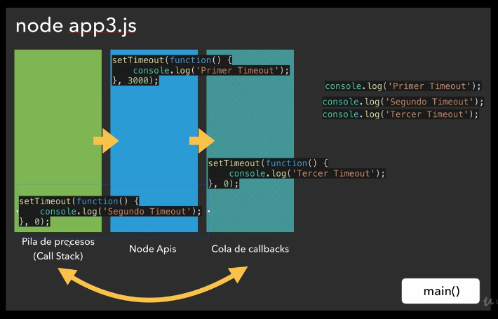

1. Instalaciones

Queda pendiente de instalación un plugin en Atom de typescript. Evaluar si es necesario.

## SEGUNDA SECCIÓN:
### Video 09:

**HOLA MUNDO EN NODE** :
Para ejecutar el programa de node, poner en consola *node <nombre de archivo>*

### Video 10 y 11:

**EVENT LOOP**:

En el archivo app2.js tenemos esto:
```javascript
console.log('Inicio del programa');

setTimeout( function(){
  console.log('Primer timeout');
}, 3000);
setTimeout( function(){
  console.log('Segundo timeout');
}, 0);
setTimeout( function(){
  console.log('Tercer timeout');
}, 2);

console.log('Final de programa');

```

Al ejecutar este archivo en la consola con *node app2* devuelve esto:
```
Inicio del programa
Final de programa
Segundo timeout
Tercer timeout
Primer timeout
```
**Ejecución síncrona y asíncrona:**

*En una ejecución síncrona*, Node crea el proceso main() en la Call Stack o pila de procesos, que ejecutará línea por línea el código que tenemos. Cada función se ejecuta y cuando acaba se elimina de la pila de procesos. En este caso, cada línea de código se ejecuta una después de la otra, por eso en app.js, las sentencias aparecen en el orden en el que está en el código. Es una ejecución síncrona.

*En una ejecución asíncrona*, Node crea el proceso main() en la Call Stack o pila de procesos. Comienza con un console.log que dice q se inicia el programa, luego la primera función q como tiene un setTimeout de 3 segundos, pasa a la pila de Node Apis, luego carga el siguiente setTimeout pero aunque tiene 0 segundos para su ejecución, lo pasa igualmente a la parte de Node Apis. Una vez está ahí, si es el momento de ejecutarse NO LO PASA A MAIN, sino que lo pasa a un tercer espacio llamado cola de callbacks. Y lo rellena con los callbacks restantes una vez hayan llegado a su momento de ejecución. ANTES de sacar lo que haya en la cola del callbacks, sigue pasando a la pila de procesos (Call Stack) las funciones que no tienen callbacks, cuando acaban, va sacando en orden de entrada en la pila de cola de callbacks:


